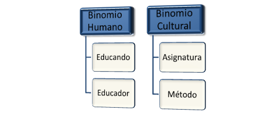

# Didáctica {#did-ctica}

Dentro de la Ciencia de la Educación propiamente dicha, se encuentra la didáctica que es el acto educativo.

La Didáctica es la disciplina pedagógica de carácter práctico y operativo. Dentro del ámbito de la Didáctica existen dos bimonios:

1-Binomio humano:    El educando: aprende (factor decisivo)

El educador: enseña y orienta

2-      Binomio cultural:         La asignatura, que sirve al alumno

El método, que favorece al aprendizaje

En un principio el alumno aprende imitando al profesor, en sus movimientos, hasta en el sonido dependiendo de la madurez del alumno. Es decir que comienza con un desarrollo psico-motriz, luego asimila los conocimientos que le otorga el profesor mediante un aprendizaje significativo y por último utiliza las dos primeras fases para llegar a interpretar.

El educador debe tener conocimientos sobre el instrumento del cual va a impartir las clases, tener la comprensión suficiente para ser consciente de la personalidad del alumno, su predisposición para el estudio, su motivación y sus condiciones para el instrumento. Debe existir una comunicación entre educador y educando, factor indispensable para que el proceso de enseñanza-aprendizaje se realice con éxito.

La asignatura se encuentra inmersa dentro de un Currículo de grado y generalmente responde a una guía docente donde existen unas normas y contenidos a las que el profesor debe sujetarse.

En cuanto a la metodología, por lo general en los conservatorios no existe una metodología específica instrumental sino que cada profesor se guía por sus propias experiencias, cómo aprendió él, o eventualmente alguno investiga sobre la pedagogía y la didáctica de su instrumento. Hay determinados instrumentos que poseen métodos para hacer escalas, arpegios, etc que son consultados por algunos profesores, pero no siempre sucede así.

Objetivo principal:

·         Técnica de la enseñanza,

·         Técnica de dirigir y orientar a los alumnos en el aprendizaje.

El objetivo es el resultado consciente previsto y deseado como producto del aprendizaje.

 Categorías de Objetivos:

·         Habilidades, destrezas, hábitos.

·         Actitudes

·         Conocimientos

Las habilidades específicas, las destrezas (como tocar un instrumento) y los hábitos físicos, mental, moral y social se encuentran dentro de los automatismos.

Dentro de los cognoscitivos encontramos el Conocimiento que es lo esencial y necesario partiendo de hechos concretos.

Y de base afectiva, son los ideales.